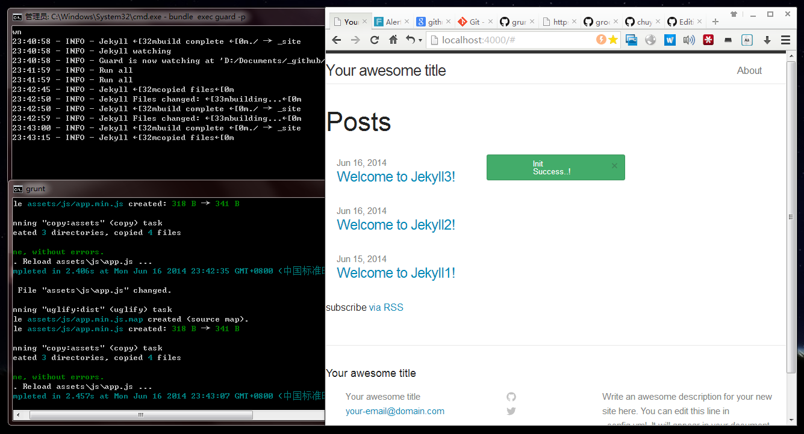

# jekyll-foundation-sass-compass-base #
> Ready for jekyll development with foundation/sass/compass/liverload/grunt built-in.

> **NOTE:**
> The base was built up on **Windows 7**, and it should work for Mac OS X.

## What's inside? ##
* Jekyll
* Foundation 5: a responsive front-end framework like *bootstrap*
* Sass: easier to write awesome css
* Compass: more easier to write awesome css
* Grunt: compile, compress, liverload, deploy, etc
* Bower: help manage the front-end packages

## Get started ##

#### Prerequisites ####
* Ruby
* RubyGems
* Node.js
* Npm

#### Checkout the project ####
```shell
git clone https://github.com/chuyik/jekyll-foundation-sass-compass-base.git
```

#### Install the plugins ####
* install Grunt
  ```shell
  npm install -g grunt-cli
  ```

* install Bower
  ```shell
  npm install -g bower
  ```

* install plugins listed on `package.json`
  ```shell
  npm install --save-dev
  ```
  
* install plugins listed on `bower.json`
  ```shell
  bower install
  ```

* install plugins listed on `Gemfile`
  ```shell
  bundle install
  ```

#### How to start local server and watcher ####
* Start jekyll local server and watcher
> What watcher means: whenever scss/js/images file changes, it will be recompiled and redeployed, and page will be automatically reloaded.

  ```shell
  grunt
  ```

* Regenerate the jekyll html files with highspeed
> Powered by [jekyll-plus](https://github.com/imathis/guard-jekyll-plus)

  ```shell
  bundle exec guard -p
  ```

## Done? ##
Open [http://localhost:4000](http://localhost:4000), and congrats if you can see the alert comes up like this.


